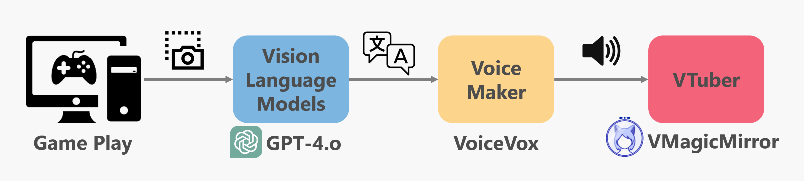

<div align="center">
<h1>
    <br>
    AutoStreaming-VTuber
    <br>
</h1>

</div>

> [!NOTE]
> You need OpenAI API key.

# Demo
## Playing Screen


## Demo using gradio


# Technology

### Backend
- Python(FastAPI, Pillow, OpenAI)
- [VOICEVOX ENGINE](https://github.com/VOICEVOX/voicevox_engine)
- [VMagicMirror](https://github.com/malaybaku/VMagicMirror)

# Running code
1. Clone my repository
    ```
    git clone https://github.com/Treeitsuki/AutoStreaming-VTuber.git
    ```
1. Set up [VMagicMirror](https://malaybaku.github.io/VMagicMirror/)

    https://malaybaku.github.io/VMagicMirror/download/

1. Run ShellScript
    ```
    bash main.sh
    ```


